# Site Structure

Current route and layout map for the Tiles & More site.

## Visual Chart

```mermaid
flowchart TD
    A["Tiles & More Site"] --> B["Public Site (main)"]
    A --> C["Admin Area (admin)"]
    A --> D["API Routes (/api/*)"]

    B --> B0["Shared Layout<br/>Navbar + SiteIntro + Footer"]
    B0 --> B1["/ Home<br/>Hero + Featured Categories + Collections"]
    B0 --> B2["/about About"]
    B0 --> B3["/catalog Catalog<br/>Filters + Product Grid + Category Grid"]
    B0 --> B4["/catalog/[category] Category Detail<br/>Category Header + Product Grid"]
    B0 --> B5["/products/[slug] Product Detail<br/>Gallery + Specs"]
    B0 --> B6["/collections Collections<br/>Featured Collections Grid"]
    B0 --> B7["/gallery Gallery"]
    B0 --> B8["/contact Contact<br/>Contact Form + Inquiry Cart"]
    B0 --> B9["/quote Request Quote<br/>Quote Form"]
    B0 --> B10["/privacy Privacy"]
    B0 --> B11["/terms Terms"]

    C --> C0["Shared Admin Layout<br/>Sidebar Navigation"]
    C0 --> C1["/admin Dashboard"]
    C0 --> C2["/admin/products Products"]
    C0 --> C3["/admin/products/new New Product"]
    C0 --> C4["/admin/products/[id] Edit Product"]
    C0 --> C5["/admin/categories Categories"]
    C0 --> C6["/admin/collections Collections"]
    C0 --> C7["/admin/gallery Gallery"]
    C0 --> C8["/admin/inquiries Inquiries"]

    D --> D1["GET /api/products"]
    D --> D2["GET /api/inquiries"]
    D --> D3["POST /api/inquiries"]
    D --> D4["POST /api/upload"]
```



## Route Tree

```text
/
|-- (main layout: SiteIntro > Navbar > page content > Footer)
|   |-- /                     Home
|   |-- /about                About
|   |-- /catalog              Catalog
|   |   `-- /catalog/[category]   Category detail
|   |-- /products/[slug]      Product detail
|   |-- /collections          Collections
|   |-- /gallery              Gallery
|   |-- /contact              Contact
|   |-- /quote                Request Quote
|   |-- /privacy              Privacy policy
|   `-- /terms                Terms and conditions
|
|-- /admin (admin layout: sidebar + content)
|   |-- /admin                Dashboard
|   |-- /admin/products       Products list
|   |-- /admin/products/new   New product
|   |-- /admin/products/[id]  Edit product
|   |-- /admin/categories     Categories
|   |-- /admin/collections    Collections
|   |-- /admin/gallery        Gallery
|   `-- /admin/inquiries      Inquiries
|
`-- /api
    |-- /api/products         GET products
    |-- /api/inquiries        GET inquiries, POST inquiry
    `-- /api/upload           POST upload
```

## Main Building Blocks

- `src/app/(main)` contains the public-facing pages.
- `src/app/(admin)` contains the admin pages and sidebar layout.
- `src/app/api` contains the current mock-oriented API endpoints.
- `src/components/sections` powers the homepage sections.
- `src/components/product` powers catalog and product detail UI.
- `src/components/forms` powers contact, quote, and inquiry interactions.
- `src/data` is the current mock content source.
- `src/services` reads from that mock data layer today.
