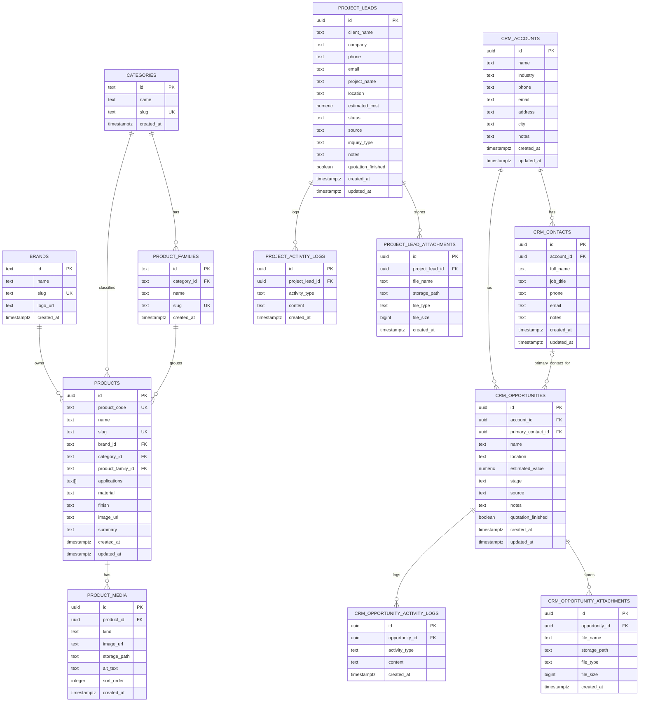

# Supabase Database ERD

This document describes the current database structure for the Supabase backend.

## Overview

The schema is organized into three main domains:

1. **Catalog**
   - Brands
   - Categories
   - Product families
   - Products
   - Product media

2. **CRM**
   - Accounts
   - Contacts
   - Opportunities
   - Opportunity activity logs
   - Opportunity attachments

3. **Project Leads**
   - Project leads
   - Project activity logs
   - Project lead attachments

---

## ER Diagram

---

## Domain Breakdown

### 1. Catalog

#### `brands`
Stores product brands.

| Column | Type | Notes |
|---|---|---|
| id | text | Primary key |
| name | text | Brand name |
| slug | text | Unique brand slug |
| logo_url | text | Optional logo |
| created_at | timestamptz | Creation timestamp |

#### `categories`
Stores top-level product categories.

| Column | Type | Notes |
|---|---|---|
| id | text | Primary key |
| name | text | Category name |
| slug | text | Unique category slug |
| created_at | timestamptz | Creation timestamp |

#### `product_families`
Groups products under a category.

| Column | Type | Notes |
|---|---|---|
| id | text | Primary key |
| category_id | text | FK to `categories.id` |
| name | text | Family name |
| slug | text | Unique family slug |
| created_at | timestamptz | Creation timestamp |

#### `products`
Main product catalog table.

| Column | Type | Notes |
|---|---|---|
| id | uuid | Primary key |
| product_code | text | Unique product code |
| name | text | Product name |
| slug | text | Unique product slug |
| brand_id | text | FK to `brands.id` |
| category_id | text | FK to `categories.id` |
| product_family_id | text | FK to `product_families.id` |
| applications | text[] | Array of use cases / applications |
| material | text | Optional material |
| finish | text | Optional finish |
| image_url | text | Optional cover image |
| summary | text | Optional description |
| created_at | timestamptz | Creation timestamp |
| updated_at | timestamptz | Update timestamp |

#### `product_media`
Additional media for each product.

| Column | Type | Notes |
|---|---|---|
| id | uuid | Primary key |
| product_id | uuid | FK to `products.id` |
| kind | text | `application` or `sample` |
| image_url | text | Public image URL |
| storage_path | text | Optional storage path |
| alt_text | text | Optional alt text |
| sort_order | integer | Display ordering |
| created_at | timestamptz | Creation timestamp |

---

### 2. CRM

#### `crm_accounts`
Represents companies or organizations in the CRM.

| Column | Type | Notes |
|---|---|---|
| id | uuid | Primary key |
| name | text | Account name |
| industry | text | Optional industry |
| phone | text | Optional phone |
| email | text | Optional email |
| address | text | Optional address |
| city | text | Optional city |
| notes | text | Optional notes |
| created_at | timestamptz | Creation timestamp |
| updated_at | timestamptz | Update timestamp |

#### `crm_contacts`
Contacts belonging to CRM accounts.

| Column | Type | Notes |
|---|---|---|
| id | uuid | Primary key |
| account_id | uuid | FK to `crm_accounts.id` |
| full_name | text | Contact name |
| job_title | text | Optional role |
| phone | text | Optional phone |
| email | text | Optional email |
| notes | text | Optional notes |
| created_at | timestamptz | Creation timestamp |
| updated_at | timestamptz | Update timestamp |

#### `crm_opportunities`
Sales opportunities tied to an account and optionally to a primary contact.

| Column | Type | Notes |
|---|---|---|
| id | uuid | Primary key |
| account_id | uuid | FK to `crm_accounts.id` |
| primary_contact_id | uuid | Optional FK to `crm_contacts.id` |
| name | text | Opportunity name |
| location | text | Optional project location |
| estimated_value | numeric | Must be `>= 0` when present |
| stage | text | Pipeline status |
| source | text | Lead source |
| notes | text | Optional notes |
| quotation_finished | boolean | Quote completion flag |
| created_at | timestamptz | Creation timestamp |
| updated_at | timestamptz | Update timestamp |

**Allowed `stage` values**
- `new_lead`
- `opportunity`
- `bidding`
- `negotiation`
- `awarded`
- `ongoing`
- `completed`
- `lost`

#### `crm_opportunity_activity_logs`
Activity timeline entries for each opportunity.

| Column | Type | Notes |
|---|---|---|
| id | uuid | Primary key |
| opportunity_id | uuid | FK to `crm_opportunities.id` |
| activity_type | text | Activity category |
| content | text | Activity details |
| created_at | timestamptz | Creation timestamp |

#### `crm_opportunity_attachments`
Files attached to an opportunity.

| Column | Type | Notes |
|---|---|---|
| id | uuid | Primary key |
| opportunity_id | uuid | FK to `crm_opportunities.id` |
| file_name | text | Original file name |
| storage_path | text | Stored file path |
| file_type | text | MIME / category |
| file_size | bigint | File size |
| created_at | timestamptz | Creation timestamp |

---

### 3. Project Leads

#### `project_leads`
Separate lead intake table for project-based inquiries.

| Column | Type | Notes |
|---|---|---|
| id | uuid | Primary key |
| client_name | text | Lead contact name |
| company | text | Optional company |
| phone | text | Optional phone |
| email | text | Optional email |
| project_name | text | Project title |
| location | text | Optional location |
| estimated_cost | numeric | Must be `>= 0` when present |
| status | text | Lead progress status |
| source | text | Lead source |
| inquiry_type | text | Optional inquiry classification |
| notes | text | Optional notes |
| quotation_finished | boolean | Quote completion flag |
| created_at | timestamptz | Creation timestamp |
| updated_at | timestamptz | Update timestamp |

**Allowed `status` values**
- `new_lead`
- `contacted`
- `quotation_in_progress`
- `quotation_sent`
- `ongoing`
- `completed`
- `on_hold`
- `lost`

#### `project_activity_logs`
Activity history for project leads.

| Column | Type | Notes |
|---|---|---|
| id | uuid | Primary key |
| project_lead_id | uuid | FK to `project_leads.id` |
| activity_type | text | Activity category |
| content | text | Activity details |
| created_at | timestamptz | Creation timestamp |

#### `project_lead_attachments`
Files attached to project leads.

| Column | Type | Notes |
|---|---|---|
| id | uuid | Primary key |
| project_lead_id | uuid | FK to `project_leads.id` |
| file_name | text | Original file name |
| storage_path | text | Stored file path |
| file_type | text | MIME / category |
| file_size | bigint | File size |
| created_at | timestamptz | Creation timestamp |

---

## Relationship Summary

### Catalog relationships
- A **brand** can have many **products**
- A **category** can have many **product families**
- A **category** can also have many **products**
- A **product family** can have many **products**
- A **product** can have many **media items**

### CRM relationships
- An **account** can have many **contacts**
- An **account** can have many **opportunities**
- A **contact** can optionally be the **primary contact** for many opportunities
- An **opportunity** can have many **activity logs**
- An **opportunity** can have many **attachments**

### Project lead relationships
- A **project lead** can have many **activity logs**
- A **project lead** can have many **attachments**

---

## Notes and Documentation Suggestions

- `products.applications` is stored as a `text[]` array instead of a normalized join table.
- `products.brand_id`, `category_id`, and `product_family_id` use `text` keys rather than `uuid`.
- The schema uses a mix of:
  - **text primary keys** for catalog lookup tables
  - **uuid primary keys** for operational/transactional tables
- `crm_opportunities` and `project_leads` both include:
  - status/stage tracking
  - notes
  - quotation flags
  - created/updated timestamps

This makes the schema well suited for:
- a public-facing product catalog
- an internal CRM for accounts and opportunities
- a separate project inquiry / lead management workflow

---

## Suggested Future Improvements

- Add `ON DELETE` rules explicitly for child tables where needed
- Consider a normalized `product_applications` table if filtering becomes more advanced
- Add audit metadata such as `created_by` and `updated_by`
- Add indexes for frequently filtered fields such as:
  - `products.brand_id`
  - `products.category_id`
  - `crm_opportunities.stage`
  - `project_leads.status`
- Consider unifying `crm_opportunities` and `project_leads` later if the workflows overlap heavily
