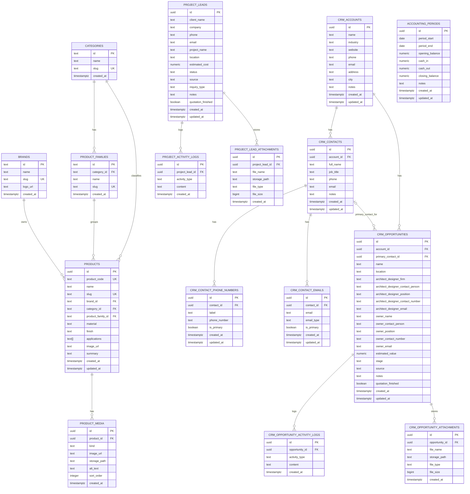

# Supabase Database ERD

This document describes the current Supabase-backed data model used by the TILES & MORE website and admin workspace.

## Purpose

The database supports four main product areas:

1. Catalog and media
2. CRM and pipeline management
3. Project leads
4. Accounting

The public website mainly consumes catalog data, while the admin workspace uses catalog, CRM, project lead, and accounting tables together.

## Domain Overview

### Catalog

- Brands
- Categories
- Product families
- Products
- Product media

### CRM

- Accounts
- Contacts
- Contact phone numbers
- Contact emails
- Opportunities
- Opportunity activity logs
- Opportunity attachments

### Project leads

- Project leads
- Project activity logs
- Project lead attachments

### Accounting

- Accounting periods

## ER Diagram

## How The Admin Workspace Uses This Schema

### Public site

The public storefront primarily reads:

- `brands`
- `categories`
- `product_families`
- `products`
- `product_media`

### CRM workspace

The admin CRM reads and writes:

- `crm_accounts`
- `crm_contacts`
- `crm_contact_phone_numbers`
- `crm_contact_emails`
- `crm_opportunities`
- `crm_opportunity_activity_logs`
- `crm_opportunity_attachments`

Important current behavior:

- Contacts belong to accounts
- Opportunities belong to accounts and can optionally point to one primary contact
- Contacts can have multiple phone numbers and multiple emails
- The CRM UI now includes a global contacts view so admins can search contacts across all accounts, not only within a single account detail page

### Reports workspace

The reports area combines:

- Catalog data
- CRM data
- Project lead data
- Inquiry data from the in-memory service layer
- Accounting data

### Accounting workspace

The accounting area currently works from:

- `accounting_periods`

## Table Reference

### Catalog

#### `brands`

| Column | Type | Notes |
|---|---|---|
| id | text | Primary key |
| name | text | Brand name |
| slug | text | Unique slug |
| logo_url | text | Optional logo |
| created_at | timestamptz | Creation timestamp |

#### `categories`

| Column | Type | Notes |
|---|---|---|
| id | text | Primary key |
| name | text | Category name |
| slug | text | Unique slug |
| created_at | timestamptz | Creation timestamp |

#### `product_families`

| Column | Type | Notes |
|---|---|---|
| id | text | Primary key |
| category_id | text | FK to `categories.id` |
| name | text | Family name |
| slug | text | Unique slug |
| created_at | timestamptz | Creation timestamp |

#### `products`

| Column | Type | Notes |
|---|---|---|
| id | uuid | Primary key |
| product_code | text | Unique product code |
| name | text | Product name |
| slug | text | Unique slug |
| brand_id | text | FK to `brands.id` |
| category_id | text | FK to `categories.id` |
| product_family_id | text | FK to `product_families.id` |
| material | text | Optional material |
| finish | text | Optional finish |
| applications | text[] | Applications array |
| image_url | text | Optional cover image |
| summary | text | Optional summary |
| created_at | timestamptz | Creation timestamp |
| updated_at | timestamptz | Update timestamp |

#### `product_media`

| Column | Type | Notes |
|---|---|---|
| id | uuid | Primary key |
| product_id | uuid | FK to `products.id` |
| kind | text | Usually `application` or `sample` |
| image_url | text | Public image URL |
| storage_path | text | Optional storage path |
| alt_text | text | Optional alt text |
| sort_order | integer | Ordering inside product gallery |
| created_at | timestamptz | Creation timestamp |

### CRM

#### `crm_accounts`

| Column | Type | Notes |
|---|---|---|
| id | uuid | Primary key |
| name | text | Account name |
| industry | text | Optional industry |
| website | text | Optional website |
| phone | text | Optional phone |
| email | text | Optional email |
| address | text | Optional address |
| city | text | Optional city |
| notes | text | Optional notes |
| created_at | timestamptz | Creation timestamp |
| updated_at | timestamptz | Update timestamp |

#### `crm_contacts`

| Column | Type | Notes |
|---|---|---|
| id | uuid | Primary key |
| account_id | uuid | FK to `crm_accounts.id` |
| full_name | text | Contact full name |
| job_title | text | Optional job title |
| phone | text | Legacy / denormalized primary phone |
| email | text | Legacy / denormalized primary email |
| notes | text | Optional notes |
| created_at | timestamptz | Creation timestamp |
| updated_at | timestamptz | Update timestamp |

Notes:

- The app still keeps `phone` and `email` on `crm_contacts` as legacy summary fields.
- The richer contact model lives in `crm_contact_phone_numbers` and `crm_contact_emails`.

#### `crm_contact_phone_numbers`

| Column | Type | Notes |
|---|---|---|
| id | uuid | Primary key |
| contact_id | uuid | FK to `crm_contacts.id` |
| label | text | Optional label such as `Main` or `Mobile` |
| phone_number | text | Stored phone number |
| is_primary | boolean | Primary phone flag |
| created_at | timestamptz | Creation timestamp |
| updated_at | timestamptz | Update timestamp |

#### `crm_contact_emails`

| Column | Type | Notes |
|---|---|---|
| id | uuid | Primary key |
| contact_id | uuid | FK to `crm_contacts.id` |
| email | text | Stored email address |
| email_type | text | `personal` or `work` |
| is_primary | boolean | Primary email flag |
| created_at | timestamptz | Creation timestamp |
| updated_at | timestamptz | Update timestamp |

#### `crm_opportunities`

| Column | Type | Notes |
|---|---|---|
| id | uuid | Primary key |
| account_id | uuid | FK to `crm_accounts.id` |
| primary_contact_id | uuid | Optional FK to `crm_contacts.id` |
| name | text | Opportunity name |
| location | text | Optional project location |
| architect_designer_firm | text | Optional architect or designer firm |
| architect_designer_contact_person | text | Optional architect or designer contact |
| architect_designer_position | text | Optional architect or designer role |
| architect_designer_contact_number | text | Optional architect or designer phone |
| architect_designer_email | text | Optional architect or designer email |
| owner_name | text | Optional owner name |
| owner_contact_person | text | Optional owner contact |
| owner_position | text | Optional owner role |
| owner_contact_number | text | Optional owner phone |
| owner_email | text | Optional owner email |
| estimated_value | numeric | Non-negative when present |
| stage | text | Opportunity pipeline stage |
| source | text | Lead source |
| notes | text | Optional notes |
| quotation_finished | boolean | Quotation flag |
| created_at | timestamptz | Creation timestamp |
| updated_at | timestamptz | Update timestamp |

Allowed `stage` values:

- `new_lead`
- `opportunity`
- `bidding`
- `negotiation`
- `awarded`
- `ongoing`
- `completed`
- `lost`

#### `crm_opportunity_activity_logs`

| Column | Type | Notes |
|---|---|---|
| id | uuid | Primary key |
| opportunity_id | uuid | FK to `crm_opportunities.id` |
| activity_type | text | Activity category |
| content | text | Activity note |
| created_at | timestamptz | Creation timestamp |

#### `crm_opportunity_attachments`

| Column | Type | Notes |
|---|---|---|
| id | uuid | Primary key |
| opportunity_id | uuid | FK to `crm_opportunities.id` |
| file_name | text | Original file name |
| storage_path | text | File storage path |
| file_type | text | MIME type or file classification |
| file_size | bigint | File size |
| created_at | timestamptz | Creation timestamp |

### Project leads

#### `project_leads`

| Column | Type | Notes |
|---|---|---|
| id | uuid | Primary key |
| client_name | text | Lead contact name |
| company | text | Optional company |
| phone | text | Optional phone |
| email | text | Optional email |
| project_name | text | Project title |
| location | text | Optional location |
| estimated_cost | numeric | Non-negative when present |
| status | text | Lead status |
| source | text | Lead source |
| inquiry_type | text | Optional inquiry type |
| notes | text | Optional notes |
| quotation_finished | boolean | Quote completion flag |
| created_at | timestamptz | Creation timestamp |
| updated_at | timestamptz | Update timestamp |

Allowed `status` values:

- `new_lead`
- `contacted`
- `quotation_in_progress`
- `quotation_sent`
- `ongoing`
- `completed`
- `on_hold`
- `lost`

#### `project_activity_logs`

| Column | Type | Notes |
|---|---|---|
| id | uuid | Primary key |
| project_lead_id | uuid | FK to `project_leads.id` |
| activity_type | text | Activity type |
| content | text | Activity note |
| created_at | timestamptz | Creation timestamp |

#### `project_lead_attachments`

| Column | Type | Notes |
|---|---|---|
| id | uuid | Primary key |
| project_lead_id | uuid | FK to `project_leads.id` |
| file_name | text | Original file name |
| storage_path | text | File storage path |
| file_type | text | MIME type or file classification |
| file_size | bigint | File size |
| created_at | timestamptz | Creation timestamp |

### Accounting

#### `accounting_periods`

| Column | Type | Notes |
|---|---|---|
| id | uuid | Primary key |
| period_start | date | Period start date |
| period_end | date | Period end date |
| opening_balance | numeric | Starting balance |
| cash_in | numeric | Incoming cash total |
| cash_out | numeric | Outgoing cash total |
| closing_balance | numeric | Ending balance |
| notes | text | Optional notes |
| created_at | timestamptz | Creation timestamp |
| updated_at | timestamptz | Update timestamp |

## Relationship Summary

### Catalog

- A brand has many products
- A category has many product families
- A category has many products
- A product family has many products
- A product has many media items

### CRM

- An account has many contacts
- A contact has many phone numbers
- A contact has many email entries
- An account has many opportunities
- A contact can be the primary contact on many opportunities
- An opportunity has many activity logs
- An opportunity has many attachments

### Project leads

- A project lead has many activity logs
- A project lead has many attachments

## Notes

- Catalog lookup tables use `text` primary keys, while operational tables use `uuid`.
- `crm_contacts.phone` and `crm_contacts.email` are retained as legacy summary fields even though the richer model is now normalized.
- `products.applications` is stored as a `text[]` array rather than a join table.
- The app currently mixes fully database-backed domains with a lightweight in-memory inquiry service.

## Recommended Maintenance Rules

When the app changes, update this document if any of the following happen:

- a new admin workflow introduces a new table or relation
- a CRM field is added or removed
- project lead status rules change
- accounting fields change
- product media behavior changes

Keep this file aligned with:

- `CRM_SCHEMA.sql`
- `ACCOUNTING_SCHEMA.sql`
- the service layer in `src/services`
